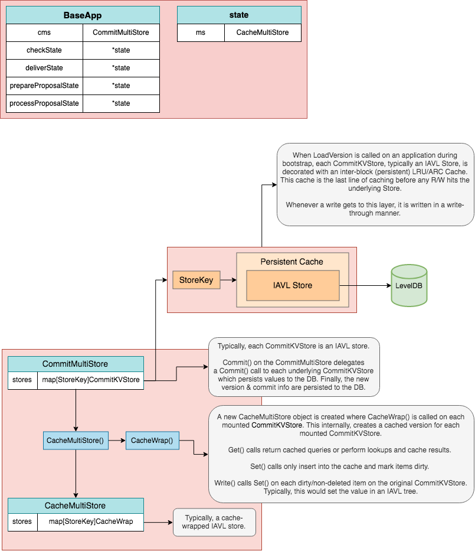
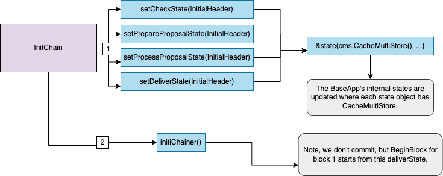
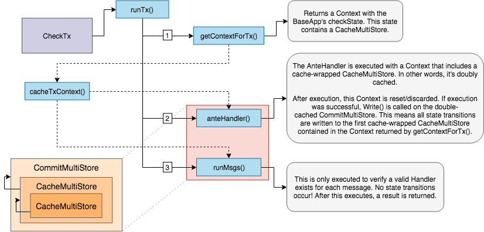
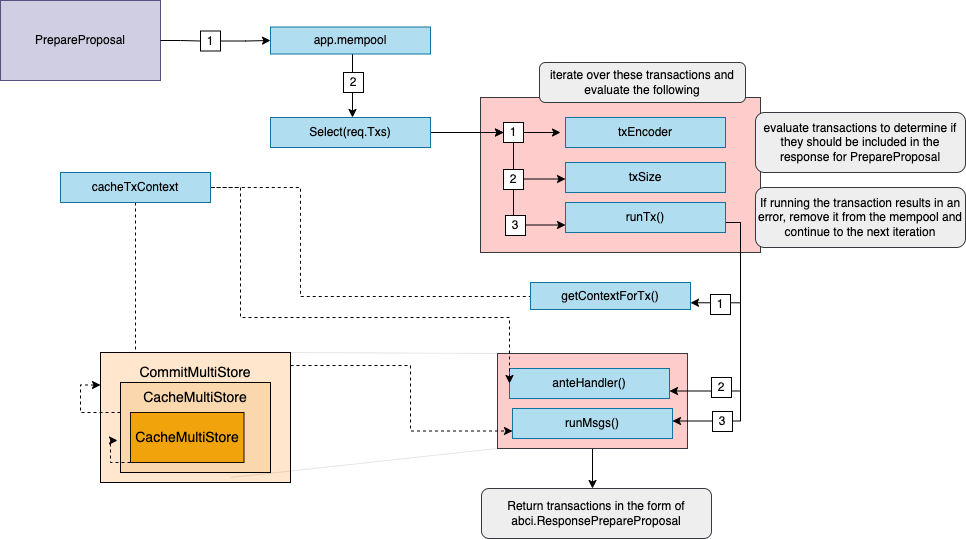
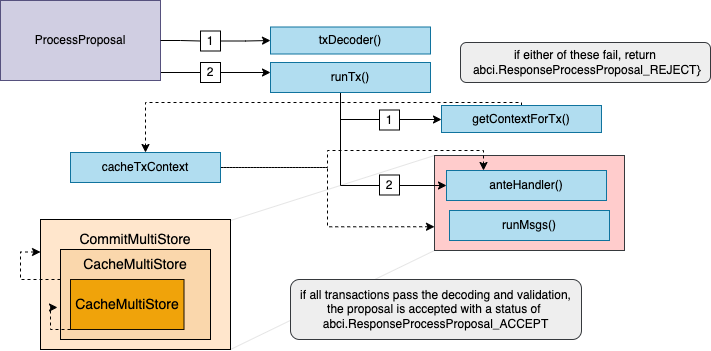

# BaseApp

:::note Synopsis
This document describes `BaseApp`, the abstraction that implements the core functionalities of a Cosmos SDK application.
:::

:::note Pre-requisite Readings

* [Anatomy of a Cosmos SDK application](../basics/00-app-anatomy.md)
* [Lifecycle of a Cosmos SDK transaction](../basics/01-tx-lifecycle.md)

:::

## Introduction

`BaseApp`は、Cosmos SDKアプリケーションのコアを実装するベースタイプです。具体的には以下の機能を備えています：

* [アプリケーション・ブロックチェーン・インターフェース](#main-abci-messages)：ステートマシンが基盤となるコンセンサスエンジン（例：CometBFT）と通信するためのインターフェースです。
* [サービス・ルーター](#service-routers)：メッセージやクエリを適切なモジュールにルーティングするための仕組みです。
* [ステートの更新](#state-updates)：受信したABCIメッセージに基づいて異なるボラティルなステートを更新する機能が含まれています。

`BaseApp`の目的は、開発者が独自のカスタムアプリケーションを簡単に構築できるように、Cosmos SDKアプリケーションの基本的なレイヤーを提供することです。通常、開発者は次のようにしてアプリケーションのカスタム型を作成します：


```go
type App struct {
  // reference to a BaseApp
  *baseapp.BaseApp

  // list of application store keys

  // list of application keepers

  // module manager
}
```

`BaseApp`を使用してアプリケーションを拡張することで、前者は`BaseApp`のすべてのメソッドにアクセスできるようになります。
これにより、開発者は必要なモジュールを使用して独自のアプリケーションを構築できますが、ABCIの実装、サービス・ルーター、およびステート管理ロジックを実装する手間をかける必要はありません。

## Type Definition

`BaseApp`タイプは、Cosmos SDKベースのアプリケーションの多くの重要なパラメータを保持しています。

```go reference
https://github.com/cosmos/cosmos-sdk/blob/v0.50.0-alpha.0/baseapp/baseapp.go#L58-L182
```

最も重要なコンポーネントを見ていきましょう。

> **注意**: すべてのパラメータが説明されているわけではありません。詳細な一覧については、型定義を参照してください。

まず、アプリケーションの起動時に初期化される重要なパラメータ：

* [`CommitMultiStore`](./04-store.md#commitmultistore): これはアプリケーションのメインストアで、
  ブロックの[終了時](#commit)にコミットされる正準なステートを保持します。このストアは**キャッシュされていません**。
  つまり、アプリケーションのボラティル（未コミットの）ステートの更新には使用されません。
  `CommitMultiStore`はマルチストアであり、ストアの集合です。アプリケーションの各モジュールは、
  マルチストア内の1つまたは複数の`KVStore`を使用して、その状態のサブセットを永続化します。
* データベース：`db`はデータの永続化を処理するために`CommitMultiStore`によって使用されます。
* [`Msg` サービスルーター](#msg-service-router)：`msgServiceRouter`は、`sdk.Msg`リクエストを適切な
  モジュール`Msg`サービスにルーティングして処理するのを支援します。ここでの`sdk.Msg`は、
  アプリケーションの状態を更新するためにサービスによって処理されるトランザクションコンポーネントを指し、
  アプリケーションと基盤となるコンセンサスエンジン間のインターフェースであるABCIメッセージではありません。
* [gRPC クエリルーター](#grpc-query-router)：`grpcQueryRouter`は、gRPCクエリを適切なモジュールに
  ルーティングして処理するのを支援します。これらのクエリ自体はABCIメッセージではありませんが、
  関連するモジュールのgRPC `Query`サービスにリレーされます。
* [`TxDecoder`](https://pkg.go.dev/github.com/cosmos/cosmos-sdk/types#TxDecoder)：基盤となるCometBFTエンジンに
  よってリレーされる生のトランザクションバイトをデコードするために使用されます。
* [`AnteHandler`](#antehandler)：このハンドラは、トランザクションが受信された際に署名の検証、
  手数料支払い、および他のメッセージの実行前チェックを行うために使用されます。これは[`CheckTx/RecheckTx`](#checktx)および
  [`FinalizeBlock`](#finalizeblock)の実行中に実行されます。
* [`InitChainer`](../basics/00-app-anatomy.md#initchainer)、
  [`BeginBlocker`と`EndBlocker`](../basics/00-app-anatomy.md#beginblocker-and-endblocker)：これらは
  アプリケーションが基盤となるCometBFTエンジンから`InitChain`および`FinalizeBlock`のABCIメッセージを受信したときに実行される関数です。

次に、[ボラティルステート](#state-updates)（キャッシュされたステート）を定義するために使用されるパラメータ：

* `checkState`：これは[`CheckTx`](#checktx)中に更新され、[`Commit`](#commit)時にリセットされます。
* `finalizeBlockState`：これは[`FinalizeBlock`](#finalizeblock)中に更新され、[`Commit`](#commit)時に`nil`に設定され、`FinalizeBlock`で再初期化されます。
* `processProposalState`：これは[`ProcessProposal`](#process-proposal)中に更新されます。

最後に、さらにいくつかの重要なパラメータがあります。

* `voteInfos`：このパラメータは、事前コミットが欠落しているバリデータのリストを保持します。これは、彼らが投票しなかったか、または提案者が彼らの投票を含めなかったためです。この情報は[Context](./02-context.md)によって伝達され、アプリケーションは異なることに使用できます。異常なバリデータの罰則などです。
* `minGasPrices`：このパラメータは、ノードが受け入れる最小のガス価格を定義します。これは**ローカル**パラメータであり、各フルノードは異なる`minGasPrices`を設定できます。これは主にスパム保護メカニズムとして、[`CheckTx`](#checktx)中の`AnteHandler`で使用されます。トランザクションは[mempool](https://github.com/cometbft/cometbft/blob/v0.37.x/spec/abci/abci++_basic_concepts.md#mempool-methods)に入るために、トランザクションのガス価格が`minGasPrices`の最小ガス価格のいずれかよりも大きい場合にのみ入ります（たとえば、`minGasPrices == 1uatom,1photon`の場合、トランザクションの`gas-price`は`1uatom`または`1photon`よりも大きくなければなりません）。
* `appVersion`：アプリケーションのバージョン。これは[アプリケーションのコンストラクタ関数](../basics/00-app-anatomy.md#constructor-function)で設定されます。


## Constructor

```go
func NewBaseApp(
  name string, logger log.Logger, db dbm.DB, txDecoder sdk.TxDecoder, options ...func(*BaseApp),
) *BaseApp {

  // ...
}
```

`BaseApp`のコンストラクタ関数は非常にわかりやすいです。注意する価値があるのは、追加の[`options`](https://github.com/cosmos/cosmos-sdk/blob/v0.50.0-alpha.0/baseapp/options.go)を`BaseApp`に提供できることです。これらの`options`は通常、`SetPruning()`を使用して剪定オプションを設定するか、`SetMinGasPrices()`を使用してノードの`min-gas-prices`を設定するなど、重要なパラメータの`setter`関数です。

もちろん、開発者はアプリケーションのニーズに基づいて追加の`options`を追加できます。

## State Updates

`BaseApp`は主に4つの主要な揮発性ステートとルートまたはメインステートを維持しています。メインステートはアプリケーションの正準状態であり、揮発性ステートである`checkState`、`prepareProposalState`、`processProposalState`、および`finalizeBlockState`は、メインステートとの間のステート遷移を処理するために使用されます。これらの遷移は[`Commit`](#commit)中に行われます。

内部的には、単一の`CommitMultiStore`が存在し、これをメインまたはルートステートと呼んでいます。このルートステートから、`CacheWrap`関数によって実行されるメカニズムである_store branching_を使用して、4つの揮発性ステートを導出します。その型は次のように示されます：




### InitChain State Updates

`InitChain`中、`checkState`、`prepareProposalState`、`processProposalState`、`finalizeBlockState`の4つの揮発性ステートは、ルートの`CommitMultiStore`を分岐させて設定されます。その後のすべての読み書きは、`CommitMultiStore`の分岐バージョンで行われます。
メインステートへの不必要なラウンドトリップを避けるため、分岐したストアへのすべての読み取りはキャッシュされます。



### CheckTx State Updates

`CheckTx`中、最後にコミットされたルートストアから派生した`checkState`は、すべての読み取りと書き込みに使用されます。ここでは`AnteHandler`を実行し、トランザクション内の各メッセージに対してサービスルーターが存在するかを確認します。`AnteHandler`を実行する際には、すでに分岐された`checkState`を分岐させます。
これにより、`AnteHandler`が失敗する場合、ステートの遷移は`checkState`には反映されないという副作用があります。つまり、`checkState`は成功時にのみ更新されます。



### PrepareProposal State Updates

`PrepareProposal`中、`prepareProposalState`はルートの`CommitMultiStore`を分岐させて設定されます。
`prepareProposalState`は、`PrepareProposal`フェーズ中に発生するすべての読み取りと書き込みに使用されます。
この関数は、メンプールの`Select()`メソッドを使用してトランザクションを反復処理します。その後、`runTx`が呼び出され、各トランザクションがエンコードおよび検証され、そこから`AnteHandler`が実行されます。
成功した場合、有効なトランザクションが提案の実行中に生成されるイベント、タグ、データを含めて返されます。
ここで説明した動作はデフォルトハンドラーのものであり、アプリケーションは独自の[カスタムメンプールハンドラー](https://docs.cosmos.network/main/building-apps/app-mempool#custom-mempool-handlers)を定義する柔軟性があります。



### ProcessProposal State Updates

`ProcessProposal`中、`processProposalState`は、ルートストアから最後にコミットされたステートを基に設定され、バリデータから受信した署名付き提案を処理するために使用されます。
このステートでは、`runTx`が呼び出され、`AnteHandler`が実行され、このステートで使用されるコンテキストは、ヘッダーとメインステートからの情報を含み、最小ガス価格も設定されます。
ここでも、説明した動作はデフォルトハンドラーのものであり、アプリケーションは独自の[カスタムメンプールハンドラー](https://docs.cosmos.network/main/building-apps/app-mempool#custom-mempool-handlers)を定義する柔軟性があります。



### FinalizeBlock State Updates

`FinalizeBlock`中、`finalizeBlockState`はトランザクションの実行とエンドブロックの際に使用するために設定されます。
`finalizeBlockState`は、ルートストアから最後にコミットされたステートを基に分岐されます。
注意してくださいが、`finalizeBlockState`は[`Commit`](#commit)時に`nil`に設定されます。

トランザクションの実行のステートフローは、`CheckTx`とほぼ同じですが、ステートの遷移は`finalizeBlockState`で行われ、トランザクション内のメッセージが実行されます。
`CheckTx`と同様に、ステートの遷移はダブルブランチのステートで行われます。成功したメッセージの実行により、`finalizeBlockState`への書き込みがコミットされます。
注意してくださいが、メッセージの実行が失敗すると、`AnteHandler`からのステートの遷移が永続化されます。

### Commit State Updates

`Commit`中、`finalizeBlockState`で発生したすべてのステートの遷移が最終的にルートの`CommitMultiStore`に書き込まれ、それがディスクにコミットされて新しいアプリケーションのルートハッシュが生成されます。これらのステートの遷移は今や最終的と見なされます。最後に、`checkState`が新たにコミットされたステートに設定され、`finalizeBlockState`は`FinalizeBlock`でリセットされるために`nil`に設定されます。


## ParamStore

`InitChain`中、`RequestInitChain`は`ConsensusParams`を提供します。これにはブロック実行に関連するパラメータ（最大ガスやサイズなど）と、証拠に関するパラメータが含まれます。これらのパラメータが`nil`でない場合、これらはBaseAppの`ParamStore`に設定されます。裏で、`ParamStore`は`x/consensus_params`モジュールによって管理されています。これにより、パラメータはオンチェーンガバナンスを介して調整できるようになります。

## Service Routers

アプリケーションがメッセージやクエリを受信すると、それらは処理されるために適切なモジュールにルーティングされる必要があります。ルーティングは`BaseApp`を介して行われ、メッセージのために`msgServiceRouter`、クエリのために`grpcQueryRouter`を保持しています。

### `Msg` Service Router

[`sdk.Msg`](../building-modules/02-messages-and-queries.md#messages)は、トランザクションから抽出された後にルーティングされる必要があります。これらのトランザクションは、基盤となるCometBFTエンジンから[`CheckTx`](#checktx)と[`FinalizeBlock`](#finalizeblock)のABCIメッセージを介して送信されます。これを行うために、`BaseApp`は`msgServiceRouter`を保持し、完全修飾されたサービスメソッド（各モジュールのProtobuf `Msg`サービスで定義される`string`）を適切なモジュールの`MsgServer`実装にマップします。

[デフォルトの`msgServiceRouter`](https://github.com/cosmos/cosmos-sdk/blob/v0.50.0-alpha.0/baseapp/msg_service_router.go)はステートレスです。ただし、一部のアプリケーションは、ガバナンスによって特定のルートを無効にしたり、アップグレードの目的で新しいモジュールにポイントしたりするなど、より状態を持つルーティングメカニズムを利用したい場合があります。そのため、`sdk.Context`も各[ルートハンドラー内で`msgServiceRouter`に渡されます](https://github.com/cosmos/cosmos-sdk/blob/v0.50.0-alpha.0/baseapp/msg_service_router.go#L31-L32)。これを使用しないステートレスなルーターの場合、`ctx`を無視することができます。


アプリケーションの`msgServiceRouter`は、すべてのルートがアプリケーションの[モジュールマネージャー](../building-modules/01-module-manager.md#manager)（`RegisterServices`メソッドを介して）を使用して初期化されます。モジュールマネージャー自体は、アプリケーションの[コンストラクタ](../basics/00-app-anatomy.md#constructor-function)でアプリケーションのすべてのモジュールで初期化されます。

### gRPC Query Router

`sdk.Msg`と同様に、[`クエリ`](../building-modules/02-messages-and-queries.md#queries)も適切なモジュールの[`Query`サービス](../building-modules/04-query-services.md)にルーティングする必要があります。これを行うために、`BaseApp`は`grpcQueryRouter`を保持し、モジュールの完全修飾されたサービスメソッド（各モジュールのProtobuf `Query` gRPCで定義される`string`）を適切なモジュールの`QueryServer`実装にマップします。`grpcQueryRouter`はクエリ処理の初期段階で呼び出されます。これはgRPCクエリを直接gRPCエンドポイントに送信するか、CometBFT RPCエンドポイント上の[`Query` ABCIメッセージ](#query)を介して行われます。

`msgServiceRouter`と同様に、`grpcQueryRouter`もアプリケーションの[モジュールマネージャー](../building-modules/01-module-manager.md)（`RegisterServices`メソッドを介して）を使用してすべてのクエリルートが初期化されます。モジュールマネージャー自体は、アプリケーションの[コンストラクタ](../basics/00-app-anatomy.md#app-constructor)でアプリケーションのすべてのモジュールで初期化されます。

## Main ABCI 2.0 Messages

[アプリケーション・ブロックチェーン・インターフェース](https://github.com/cometbft/cometbft/blob/v0.37.x/spec/abci/abci++_basic_concepts.md)（ABCI）は、ステートマシンをコンセンサスエンジンに接続して機能するフルノードを形成する汎用インターフェースです。これは任意の言語でラップでき、CometBFTのようなABCI互換のコンセンサスエンジンの上に構築される各アプリケーション特化型ブロックチェーンで実装する必要があります。

コンセンサスエンジンは2つの主要なタスクを処理します：

* ネットワーキングロジックは、主にブロックパーツ、トランザクション、およびコンセンサス投票をゴシップすることから成ります。
* コンセンサスロジックは、ブロック形式のトランザクションの決定論的な順序付けとして結果を出します。

コンセンサスエンジンの役割は、ステートやトランザクションの正当性を定義することではありません。一般的に、トランザクションはコンセンサスエンジンによって`[]bytes`の形式で処理され、ABCIを介してアプリケーションに転送されてデコードおよび処理されます。ネットワーキングとコンセンサスプロセスのキーとなる時点（例：ブロックの開始、ブロックのコミット、未確認トランザクションの受信など）で、コンセンサスエンジンはステートマシンがアクションを起こすためのABCIメッセージを発行します。

Cosmos SDKを使用して開発する開発者は、ABCIを自分で実装する必要はありません。なぜなら、`BaseApp`にはインターフェースの組み込み実装が含まれているからです。ここでは、`BaseApp`が実装する主要なABCIメッセージについて説明します：

* [`Prepare Proposal`](#prepare-proposal)
* [`Process Proposal`](#process-proposal)
* [`CheckTx`](#checktx)
* [`FinalizeBlock`](#finalizeblock)
* [`ExtendVote`](#extendvote)
* [`VerifyVoteExtension`](#verifyvoteextension)


### Prepare Proposal

`PrepareProposal` 関数は、CometBFTのApplication Blockchain Interface（ABCI++）で導入された新しいメソッドの一部であり、アプリケーション全体のガバナンスシステムの重要な部分です。Cosmos SDKでは、この関数を使用してアプリケーションは処理されるトランザクションをより細かく制御し、正当なトランザクションのみがブロックチェーンにコミットされることを保証します。

`PrepareProposal` 関数の実装方法は次のとおりです：

1.  トランザクションから `sdk.Msg` を抽出します。
2.  各 `sdk.Msg` に対して `Validate()` を呼び出すことで _ステートフル_ チェックを実行します。これは _ステートレス_ チェックの後に行われ、_ステートフル_ チェックは計算コストが高いです。もし `Validate()` が失敗した場合、さらなるチェックの前に `PrepareProposal` がリソースを節約するために戻ります。
3.  アプリケーション固有の追加のチェックを実行します。これにはアカウント残高の確認や、トランザクションが提案される前に特定の条件が満たされていることを確認することなどが含まれます。
4.  コンセンサスエンジンによって処理される更新されたトランザクションを返します。

`PrepareProposal` は `CheckTx()` とは異なり、`sdk.Msg` を処理するため、ステートを直接更新できます。ただし、`FinalizeBlock()` とは異なり、ステートの更新はコミットされません。`PrepareProposal` を使用する際には注意が必要です。誤ったコーディングはネットワーク全体のライブネスに影響を与える可能性があるためです。

`PrepareProposal` は、このメソッドの後に実行される `ProcessProposal` メソッドと相補的な役割を果たします。これらの2つのメソッドの組み合わせにより、無効なトランザクションがコミットされないことを保証することが可能です。さらに、このようなセットアップは、オラクル、閾値復号化などの興味深いユースケースを生み出す可能性があります。

`PrepareProposal` は、[`abci.ResponseCheckTx`](https://github.com/cometbft/cometbft/blob/v0.37.x/spec/abci/abci++_methods.md#processproposal) の型で、基盤となるコンセンサスエンジンに対して応答を返します。応答には以下が含まれます：

*   `Code (uint32)`: 応答コード。成功した場合は `0` です。
*   `Data ([]byte)`: リザルトのバイト、あれば。
*   `Log (string):` アプリケーションのロガーの出力。非決定論的な可能性があります。
*   `Info (string):` 追加情報。非決定論的な可能性があります。


### Process Proposal

`ProcessProposal` 関数は、BaseAppによってABCIメッセージフローの一部として呼び出され、コンセンサスプロセスの `FinalizeBlock` フェーズ中に実行されます。この関数の目的は、アプリケーションにブロックの検証に対するより多くの制御を提供し、バリデータがブロックの prevote を送信する前に提案されたブロック内のすべてのトランザクションをチェックできるようにすることです。これにより、バリデータは提案されたブロック内でアプリケーション依存の作業を実行できるようになり、ブロックの即時実行などの機能を可能にし、アプリケーションが無効なブロックを拒否できるようにします。

`ProcessProposal` 関数は、次の主要なタスクを実行します：

1.  提案されたブロック内のすべてのトランザクションをチェックして提案されたブロックを検証します。
2.  提案されたブロックをアプリケーションの現在のステートと照らし合わせ、それが有効であり、実行可能であることを確認します。
3.  ブロックが有効ですべてのチェックに合格する場合、提案に基づいてアプリケーションのステートを更新します。
4.  提案処理の結果を示す CometBFT への応答を返します。

`ProcessProposal` は、アプリケーション全体のガバナンスシステムの重要な部分です。ネットワークのパラメータやその他の重要な側面を管理するために使用されます。また、一貫性のプロパティが守られることを確認します。すなわち、すべての誠実なバリデータは誠実なプロポーザーによる提案を受け入れる必要があります。

`ProcessProposal` は `PrepareProposal` メソッドと相補的な役割を果たします。`PrepareProposal` メソッドは、アプリケーションがトランザクションをより細かく制御するために使用され、必要に応じてトランザクションの並べ替え、削除、遅延、変更、追加を行うことができます。これらの2つのメソッドの組み合わせにより、無効なトランザクションがコミットされないことを保証することが可能です。さらに、このようなセットアップは、オラクル、閾値復号化などの興味深いユースケースを生み出す可能性があります。

CometBFT は、提案を受信し、CometBFTアルゴリズムが値にロックされていない場合に `ProcessProposal` を呼び出します。この時点ではアプリケーションは提案を変更することはできませんが、無効であれば拒否することができます。その場合、CometBFT は提案に対して `nil` を prevote し、これはCometBFTにとって強力なライブネスの影響を持ちます。一般的なルールとして、アプリケーションは `ProcessProposal` 経由で準備された提案を受け入れるべきです。提案の一部が無効であっても（例：無効なトランザクションなど）、アプリケーションはブロック実行時に準備された提案の無効な部分を無視できます。

ただし、これらのメソッドを使用する際には、より注意を払う必要があります。これらのメソッドを誤ってコーディングすると、CometBFTはブロックを最終化するために2/3の有効なprecommitを受信できなくなる可能性があります。

`ProcessProposal` は、[`abci.ResponseCheckTx`](https://github.com/cometbft/cometbft/blob/v0.37.x/spec/abci/abci++_methods.md#processproposal) の型で、基盤となるコンセンサスエンジンに対して応答を返します。応答には以下が含まれます：

*   `Code (uint32)`: 応答コード。成功した場合は `0` です。
*   `Data ([]byte)`: リザルトのバイト、あれば。
*   `Log (string):` アプリケーションのロガーの出力。非決定論的な可能性があります。
*   `Info (string):` 追加情報。非決定論的な可能性があります。


### CheckTx

`CheckTx` は、未確認の（つまり、まだ有効なブロックに含まれていない）トランザクションがフルノードによって受信されたときに、基盤となるコンセンサスエンジンによって送信されます。`CheckTx` の役割は、フルノードのメンプール（トランザクションがブロックに含まれるまで格納される場所）をスパムトランザクションから保護することです。未確認のトランザクションは、`CheckTx` をパスする場合にのみピアにリレーされます。

`CheckTx()` は、_ステートフル_ と _ステートレス_ の両方のチェックを実行できますが、ガス料金は `CheckTx` 中のリソース（CPU、データ負荷など）の使用に対して課金されないため、チェックを**軽量化**することが重要です。

Cosmos SDK では、トランザクションを[デコード](./05-encoding.md)した後、`CheckTx()` は以下のチェックを行うために実装されています：

1.  トランザクションから `sdk.Msg` を抽出します。
2.  各 `sdk.Msg` に対して _ステートレス_ チェックを **オプションで** 実行します。これは、_ステートレス_ チェックが _ステートフル_ チェックよりも計算コストが低いため、まず実行されます。`ValidateBasic()` が失敗した場合、_ステートフル_ チェックを実行する前に `CheckTx` が返され、リソースが節約されます。このチェックは、まだ [RFC 001](https://docs.cosmos.network/main/rfc/rfc-001-tx-validation) で定義された新しいメッセージの検証メカニズムに移行していないメッセージに対しても実行され、まだ `ValidateBasic()` メソッドを持っているメッセージに対して行われます。
3. [アカウント](../basics/03-accounts.md) に関連しない _ステートフル_ チェックを実行します。このステップでは、`sdk.Msg` の署名が有効であること、十分な手数料が提供されていること、送信アカウントに支払いに十分な資金があることを確認します。ここでは正確な [`gas`](../basics/04-gas-fees.md) カウントは行われませんが、`sdk.Msg` は処理されません。通常、[`AnteHandler`](../basics/04-gas-fees.md#antehandler) は、トランザクションとともに提供された `gas` が、生のトランザクションのサイズに基づく最小リファレンスガス量を上回るようにチェックします。これにより、ガスを提供しないトランザクションによるスパムを回避します。

`CheckTx` は `sdk.Msg` を処理しません - 正規のステートが更新される必要がある場合にのみ処理する必要があり、これは `FinalizeBlock` 中に行われます。

ステップ2およびステップ3は、[`AnteHandler`](../basics/04-gas-fees.md#antehandler)内の[`RunTx()`](#runtx-antehandler-and-runmsgs)関数によって実行されます。これは、`CheckTx()`が`runTxModeCheck`モードで呼び出すものです。`CheckTx()`の各ステップごとに、`checkState`と呼ばれる特別な[ボラティルステート](#state-updates)が更新されます。このステートは、各トランザクションの`CheckTx()`呼び出しによってトリガーされる一時的な変更を追跡するために使用されますが、[main canonical state](#main-state)を変更しません。例えば、トランザクションが`CheckTx()`を通過する際に、トランザクションの手数料は`checkState`内の送信者のアカウントから差し引かれます。最初のトランザクションの処理中に、同じアカウントから2番目のトランザクションが受信され、アカウントが最初のトランザクション中に`checkState`ですべての資金を消費した場合、2番目のトランザクションは`CheckTx`()に失敗し、拒否されます。どの場合でも、送信者のアカウントは実際には手数料を支払うことはありません。トランザクションが実際にブロックに含まれるまで、`checkState`はmain stateの最新の状態にリセットされます。`checkState`は、各ブロックが[committed](#commit)されるたびにリセットされます。

`CheckTx`は、タイプ[`abci.ResponseCheckTx`](https://github.com/cometbft/cometbft/blob/v0.37.x/spec/abci/abci++_methods.md#checktx)のアンダーラインコンセンサスエンジンに対して応答を返します。レスポンスには次の情報が含まれます：

* `Code (uint32)`: レスポンスコード。成功時は`0`。
* `Data ([]byte)`: データバイト、必要な場合。
* `Log (string)`: アプリケーションのロガーの出力。非決定論的な場合があります。
* `Info (string)`: 追加情報。非決定論的な場合があります。
* `GasWanted (int64)`: トランザクションの要求されたガス量。トランザクションを生成するユーザーによって提供されます。
* `GasUsed (int64)`: トランザクションによって消費されたガス量。`CheckTx`中では、この値はトランザクションバイトの標準コストをトランザクションの生のサイズに乗じて計算されます。以下に例を示します：

```go reference
https://github.com/cosmos/cosmos-sdk/blob/v0.50.0-alpha.0/x/auth/ante/basic.go#L102
```

* `Events ([]cmn.KVPair)`: トランザクションのフィルタリングとインデックス化のためのキーと値のタグ（例：アカウントごと）。詳細は[`event`](./08-events.md)を参照してください。
* `Codespace (string)`: コードのための名前空間。

#### RecheckTx

`Commit`の後、ブロックに含まれるトランザクションを除いた、ノードのローカルなメンプールに残っているすべてのトランザクションに対して、再度`CheckTx`が実行されます。メンプールがすべてのトランザクションを毎回ブロックがコミットされるたびに再チェックするのを防ぐために、設定オプション`mempool.recheck=false`を設定できます。Tendermint v0.32.1以降、追加の`Type`パラメータが`CheckTx`関数に提供され、着信トランザクションが新しいものか（`CheckTxType_New`）、再チェックか（`CheckTxType_Recheck`）を示します。これにより、シグネチャの検証などの特定のチェックを`CheckTxType_Recheck`中にスキップできます。

## RunTx, AnteHandler, RunMsgs, PostHandler

### RunTx

`RunTx`は、トランザクションを処理するために`CheckTx`/`Finalizeblock`から呼び出され、実行モードの2つ（`execModeCheck`または`execModeFinalize`）を区別するためのパラメータとして渡されます。`RunTx`がトランザクションを受け取る時点で、すでにデコードされています。

`RunTx`が呼び出された際の最初の手順は、適切なモード（`runTxModeCheck`または`execModeFinalize`）で`getContextForTx()`関数を呼び出して`context`の`CacheMultiStore`を取得することです。この`CacheMultiStore`は、クエリリクエストのためのキャッシュ機能（クエリリクエスト用）を備えた、トランザクションの実行のために`FinalizeBlock`で、`CheckTx`のために前のブロックの`Commit`中にインスタンス化されるmain storeのブランチです。その後、[`gas`](../basics/04-gas-fees.md)の管理のために2つの`defer func()`が呼び出されます。これらは`runTx`が戻ると実行され、実際に`gas`が消費され、エラーがあればエラーが発生します。

その後、`RunTx()`は、各`Tx`内の`sdk.Msg`に対して利用可能であれば、および後方互換性のために`ValidateBasic()`を呼び出し、事前の非状態の妥当性チェックを実行します。`sdk.Msg`のいずれかが`ValidateBasic()`をパスできない場合、`RunTx()`はエラーで返ります。

次に、アプリケーションの[`anteHandler`](#antehandler)が実行されます（存在する場合）。このステップの準備として、`checkState`/`finalizeBlockState`の`context`と`context`の`CacheMultiStore`は、`cacheTxContext()`関数を使用してブランチされます。

```go reference
https://github.com/cosmos/cosmos-sdk/blob/v0.50.0-alpha.0/baseapp/baseapp.go#L663-L680
```

これにより、`RunTx` は、`anteHandler` の実行中にステートに行われた変更をコミットしないようにすることができます。また、`anteHandler` を実装するモジュールがステートに書き込むのを防ぎ、それは Cosmos SDK の [object-capabilities](./10-ocap.md) の重要な部分です。

最後に、[`RunMsgs()`](#runmsgs) 関数が `Tx` 内の `sdk.Msg` を処理するために呼び出されます。このステップの準備として、`anteHandler` と同様に、`checkState`/`finalizeBlockState` の `context` と `context` の `CacheMultiStore` は、`cacheTxContext()` 関数を使用して分岐されます。

### AnteHandler

`AnteHandler` は、`AnteHandler` インターフェースを実装する特別なハンドラであり、トランザクションの内部メッセージが処理される前にトランザクションを認証するために使用されます。

```go reference
https://github.com/cosmos/cosmos-sdk/blob/v0.50.0-alpha.0/types/handler.go#L6-L8
```

理論的には `AnteHandler` はオプションですが、パブリックブロックチェーンネットワークの非常に重要なコンポーネントです。主な目的は次の3つです：

* スパムに対する主要な防御ラインであり、トランザクションリプレイに対する2次的な防御ライン（最初のラインはメンプール）で、手数料控除と [`sequence`](./01-transactions.md#transaction-generation) チェックを行います。
* シグネチャが有効であることを確認したり、送信者が手数料を支払うために十分な資金を持っていることを確認するなど、事前の _stateful_ な妥当性チェックを実行します。
* 取引手数料の収集を通じてステークホルダーのインセンティブを提供します。


`BaseApp` は、コンストラクタで初期化される `anteHandler` をパラメータとして保持しています。最も広く使用されている `anteHandler` は、[`auth` モジュール](https://github.com/cosmos/cosmos-sdk/blob/v0.50.0-alpha.0/x/auth/ante/ante.go) です。

`anteHandler` に関する詳細は[こちら](../basics/04-gas-fees.md#antehandler)をクリックしてください。

### RunMsgs

`RunMsgs` は `RunTx` から呼び出され、パラメータとして `runTxModeCheck` を使用してトランザクション内の各メッセージに対するルートの存在をチェックし、`execModeFinalize` を使用して実際に `sdk.Msg` を処理します。

まず、Protobuf の `Any` が表す `sdk.Msg` の `type_url` をチェックして、`sdk.Msg` の完全修飾型名を取得します。次に、アプリケーションの [`msgServiceRouter`](#msg-service-router) を使用して、その `type_url` に関連する `Msg` サービスメソッドの存在をチェックします。この時点で、`mode == runTxModeCheck` ならば、`RunMsgs` は返ります。それ以外の場合、`mode == execModeFinalize` であれば、[`Msg` サービス](../building-modules/03-msg-services.md) RPC が実行され、`RunMsgs` は返ります。

### PostHandler

`PostHandler` は `AnteHandler` に類似していますが、名前からわかるように、[`RunMsgs`](#runmsgs) の後にカスタムのトランザクション後処理ロジックを実行します。`PostHandler` は `RunMsgs` の結果を受け取り、このカスタマイズ可能な動作を可能にします。

`AnteHandler` と同様に、`PostHandler` は理論的にはオプションですが、トランザクションチップ（デフォルトで simapp で有効）などの使用例があります。他にも未使用のガスの払い戻しを `PostHandler` で有効にすることもできます。
注意点として、`PostHandler` が失敗すると、`runMsgs` からのステートも元に戻され、トランザクションが失敗することになります。

```go reference
https://github.com/cosmos/cosmos-sdk/blob/v0.50.0-alpha.0/x/auth/posthandler/post.go#L1-L15
```

注意点として、`PostHandler`が失敗すると、`runMsgs`  からのステートも元に戻され、トランザクションが失敗することになります。

## Other ABCI Messages

### InitChain

[`InitChain` ABCI メッセージ](https://github.com/cometbft/cometbft/blob/v0.37.x/spec/abci/abci++_basic_concepts.md#method-overview) は、チェーンが最初に開始されたときに基盤となる CometBFT エンジンから送信されます。これは主に以下のようなパラメータとステートの**初期化**に使用されます：


* [`setConsensusParams`](https://github.com/cometbft/cometbft/blob/v0.37.x/spec/abci/abci++_app_requirements.md#consensus-parameters) 経由でコンセンサスパラメータ。
* `setState` を介した [`checkState` および `finalizeBlockState`](#state-updates)。
* ジェネシストランザクションを処理するための無限のガスを持つ [ブロックガスメーター](../basics/04-gas-fees.md#block-gas-meter)。

最後に、`BaseApp` の `InitChain(req abci.RequestInitChain)` メソッドは、アプリケーションの [`initChainer()`](../basics/00-app-anatomy.md#initchainer) を呼び出して、`genesis file` からアプリケーションのメインステートを初期化し、定義されている場合は各アプリケーションモジュールの [`InitGenesis`](../building-modules/08-genesis.md#initgenesis) 関数を呼び出します。

### FinalizeBlock

[`FinalizeBlock` ABCI メッセージ](https://github.com/cometbft/cometbft/blob/v0.38.x/spec/abci/abci++_basic_concepts.md#method-overview) は、正しい提案者によって作成されたブロック提案が受信されたときに、基盤となる CometBFT エンジンから送信されます。前の `BeginBlock`、`DeliverTx`、`EndBlock` の呼び出しは、BaseApp 構造体のプライベートメソッドです。


```go reference 
https://github.com/cosmos/cosmos-sdk/blob/v0.50.0-alpha.0/baseapp/abci.go#L623
```

#### BeginBlock 

* `setState` 関数を介して `req abci.RequestFinalizeBlock` をパラメータとして渡して、最新のヘッダーを使用して [`finalizeBlockState`](#state-updates) を初期化します。

  ```go reference
  https://github.com/cosmos/cosmos-sdk/blob/v0.50.0-alpha.0/baseapp/baseapp.go#L682-L706
  ```
  
  この関数はまた、[メインガスメーター](../basics/04-gas-fees.md#main-gas-meter) をリセットします。

* `maxGas` 制限を使用して [ブロックガスメーター](../basics/04-gas-fees.md#block-gas-meter) を初期化します。ブロック内で消費される `gas` は `maxGas` を超えることはできません。このパラメータはアプリケーションのコンセンサスパラメータで定義されています。
* アプリケーションの [`beginBlocker()`](../basics/00-app-anatomy.md#beginblocker-and-endblock) を実行します。これは主に、各アプリケーションモジュールの [`BeginBlocker()`](../building-modules/05-beginblock-endblock.md#beginblock) メソッドを実行します。
* アプリケーションの [`VoteInfos`](https://github.com/cometbft/cometbft/blob/v0.37.x/spec/abci/abci++_methods.md#voteinfo) を設定します。つまり、前のブロックの _precommit_ が現在のブロックの提案者によって含まれたバリデータのリストです。この情報は [`Context`](./02-context.md) に保持され、トランザクションの実行および EndBlock で使用できるようになります。

#### Transaction Execution

ブロック提案が基盤となるコンセンサスエンジンに受信されると、そのブロック内の各トランザクションはアプリケーションによって処理される必要があります。このため、基盤となるコンセンサスエンジンは、各トランザクションを順次処理するために、FinalizeBlockメッセージ内でトランザクションをアプリケーションに送信します。

特定のブロックの最初のトランザクションが処理される前に、FinalizeBlock中に「finalizeBlockState」と呼ばれる[揮発性のステート](#state-updates)が初期化されます。このステートは、トランザクションが「FinalizeBlock」を介して処理されるたびに更新され、ブロックが[確定](#commit)されると[メインステート](#main-state)にコミットされ、その後に「nil」に設定されます。

```go reference
https://github.com/cosmos/cosmos-sdk/blob/v0.50.0-alpha.0/baseapp/baseapp.go#LL708-L743
```

`FinalizeBlock`内のトランザクション実行は、第3ステップでちょっとした注意が必要で、第5ステップが追加されることを除いて、**`CheckTx`と全く同じ手順**を踏みます。

1. `AnteHandler`は、トランザクションの`gas-prices`が十分かどうかを**チェックしません**。なぜなら、`min-gas-prices`の値である`gas-prices`はノード内でローカルなものであり、そのため一つのフルノードにとって十分であっても、別のフルノードにとっては十分でない可能性があるからです。つまり、提案者は原則としてトランザクションを無料で含めることができますが、ブロックの総手数料にボーナスを獲得するため、実際にはそのような動機はありません。
2. 各トランザクション内の`sdk.Msg`ごとに、適切なモジュールのProtobuf [`Msg`サービス](../building-modules/03-msg-services.md)にルーティングされます。追加の_状態_チェックが行われ、`finalizeBlockState`の`context`内に保持されているブランチングマルチストアは、モジュールの`keeper`によって更新されます。もし`Msg`サービスが成功すると、`context`内に保持されているブランチングマルチストアは、`finalizeBlockState`の`CacheMultiStore`に書き込まれます。


(2) で概説されている追加の第5ステップでは、ストアへの各読み書きが`GasConsumed`の値を増加させます。各操作のデフォルトコストは以下の通りです：

```go reference
https://github.com/cosmos/cosmos-sdk/blob/v0.50.0-alpha.0/store/types/gas.go#L230-L241
```

任意のタイミングで、`GasConsumed > GasWanted` の場合、関数は `Code != 0` とともに実行が失敗します。

各トランザクションは、種類が [`abci.ExecTxResult`](https://github.com/cometbft/cometbft/blob/v0.38.0-rc1/spec/abci/abci%2B%2B_methods.md#exectxresult) の基盤となるコンセンサスエンジンに対して応答を返します。この応答には以下が含まれます：

* `Code (uint32)`: 応答コード。成功の場合は `0`。
* `Data ([]byte)`: 結果のバイト列、あれば。
* `Log (string)`: アプリケーションのロガーの出力。非決定的な場合があります。
* `Info (string)`: 付加情報。非決定的な場合があります。
* `GasWanted (int64)`: トランザクションに要求されたガス量。トランザクションを生成する際にユーザーによって提供されます。
* `GasUsed (int64)`: トランザクションによって消費されたガス量。トランザクションの実行中に、トランザクションバイトの標準コストを生のトランザクションのサイズで乗算し、ストアへの読み取り/書き込みごとにガスが加算されることで計算されます。
* `Events ([]cmn.KVPair)`: トランザクションをフィルタリングおよびインデックス化するためのキー-値タグ（例：アカウント別）。詳細については [`event`s](./08-events.md) を参照してください。
* `Codespace (string)`: コードの名前空間。

#### EndBlock 

トランザクション実行が完了した後に `EndBlock` が実行されます。これにより、開発者は各ブロックの最後にロジックを実行することができます。Cosmos SDKでは、一括で `EndBlock()` メソッドを実行し、主にアプリケーションの各モジュールの `EndBlocker()` メソッドを実行するのが一般的です。

```go reference 
https://github.com/cosmos/cosmos-sdk/blob/v0.50.0-alpha.0/baseapp/baseapp.go#L747-L769
```

### Commit

[`Commit` ABCIメッセージ](https://github.com/cometbft/cometbft/blob/v0.37.x/spec/abci/abci++_basic_concepts.md#method-overview)は、フルノードがバリデータの2/3以上（投票力による重み付け）から _precommits_ を受信した後、基盤となるCometBFTエンジンから送信されます。`BaseApp`側では、`Commit(res abci.ResponseCommit)` 関数が実装され、`FinalizeBlock`中に発生したすべての有効なステート遷移をコミットし、次のブロックのためにステートをリセットします。

ステート遷移をコミットするために、`Commit`関数は`finalizeBlockState.ms`に対して`Write()`関数を呼び出します。ここで、`finalizeBlockState.ms`はメインストア`app.cms`のブランチ型マルチストアです。その後、`Commit`関数は`checkState`を最新のヘッダー（`finalizeBlockState.ctx.BlockHeader`から取得）に設定し、`finalizeBlockState`を`nil`に設定します。

最後に、`Commit`は`app.cms`のコミットのハッシュを基盤となるコンセンサスエンジンに返します。このハッシュは、次のブロックのヘッダー内で参照されます。

### Info

[`Info` ABCIメッセージ](https://github.com/cometbft/cometbft/blob/v0.37.x/spec/abci/abci++_basic_concepts.md#info-methods)は、基盤となるコンセンサスエンジンからのシンプルなクエリであり、特に起動時に行われるハンドシェイク中に後者をアプリケーションと同期させるために使用されます。呼び出されると、`BaseApp`からの`Info(res abci.ResponseInfo)`関数は、アプリケーションの名前、バージョン、および`app.cms`の最後のコミットのハッシュを返します。

### Query

[`Query` ABCIメッセージ](https://github.com/cometbft/cometbft/blob/v0.37.x/spec/abci/abci++_basic_concepts.md#info-methods)は、基盤となるコンセンサスエンジンから受信したクエリを提供するために使用されます。これには、CometBFT RPCなどのRPCを介して受信したクエリも含まれます。これはかつてアプリケーションとのインターフェースを構築するための主要なエントリーポイントでしたが、Cosmos SDK v0.40での[gRPCクエリ](../building-modules/04-query-services.md)の導入により、その使用はより限定的となりました。アプリケーションは`Query`メソッドを実装する際にいくつかのルールを遵守する必要がありますが、これは[こちら](https://github.com/cometbft/cometbft/blob/v0.37.x/spec/abci/abci++_app_requirements.md#query)で説明されています。

各CometBFTの`query`には、`path`が含まれており、これは何をクエリするかを示す`string`です。もし`path`がgRPCの完全修飾サービスメソッドに一致する場合、`BaseApp`はクエリを`grpcQueryRouter`に委任し、それを[上記](#grpc-query-router)で説明した方法で処理させます。それ以外の場合、`path`はまだgRPCルーターで処理されていないクエリを表します。`BaseApp`は`path`文字列を `/` デリミタで分割します。慣例として、分割された文字列の最初の要素（`split[0]`）には、`query`のカテゴリ（`app`、`p2p`、`store`、または`custom`）が含まれています。`BaseApp`の`Query(req abci.RequestQuery)` メソッドの実装は、次の4つの主要なクエリカテゴリを処理するシンプルなディスパッチャです：

* アプリケーション関連のクエリ（アプリケーションのバージョンをクエリするなど）は、`handleQueryApp` メソッドを介して提供されます。
* マルチストアへの直接クエリは、`handlerQueryStore` メソッドによって提供されます。これらの直接クエリは、カスタムクエリが `app.queryRouter` を介して行われるのとは異なり、主にブロックエクスプローラなどのサードパーティサービスプロバイダによって使用されます。
* P2Pクエリは、`handleQueryP2P` メソッドを介して提供されます。これらのクエリは、アドレスまたはIPによってフィルタリングされたピアのリストを含む `app.addrPeerFilter` または `app.ipPeerFilter` を返します。これらのリストは、`BaseApp`の[コンストラクタ](#constructor)内の `options` を介して最初に初期化されます。

### ExtendVote

`ExtendVote` は、アプリケーションがプリコミット投票に任意のデータを追加することを可能にします。このプロセスは決定的である必要はなく、返されるデータはバリデータプロセスに固有のものである可能性があります。

Cosmos-SDKでは、これはNoOpとして実装されています：

``` go reference 
https://github.com/cosmos/cosmos-sdk/blob/v0.50.0-alpha.0/baseapp/abci_utils.go#L274-L281
```

### VerifyVoteExtension

`VerifyVoteExtension` は、`ExtendVote` によって返されるデータが有効であることをアプリケーションが検証することを可能にします。このプロセスは決定的である必要はなく、返されるデータはバリデータプロセスに固有のものである可能性があります。

Cosmos-SDKでは、これはNoOpとして実装されています：

```go reference
https://github.com/cosmos/cosmos-sdk/blob/v0.50.0-alpha.0/baseapp/abci_utils.go#L282-L288
```
